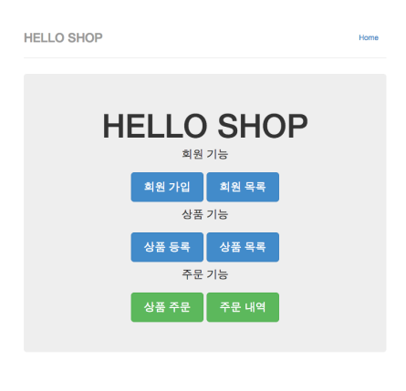
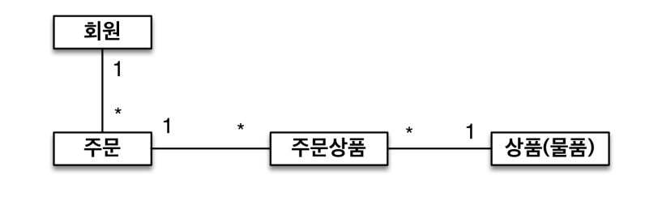
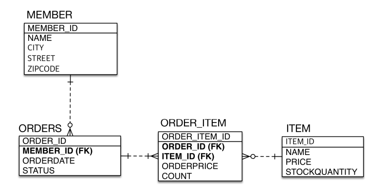
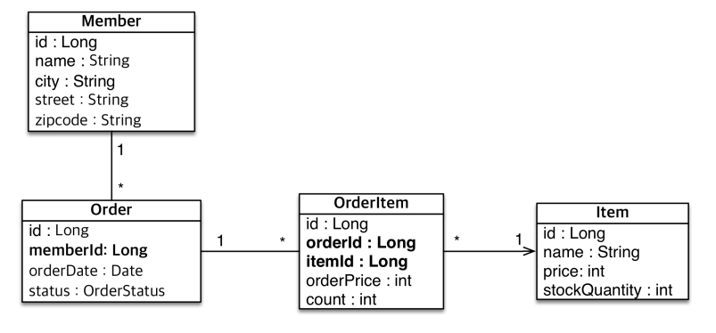

# 실전 예제 - 1. 요구사항 분석과 기본 매핑

## 요구사항 분석
- 회원은 상품을 주문할 수 있다.
= 주문 시 여러 종류의 상품을 선택할 수 있다.

## 기능 목록
- 회원 기능
    - 회원 등록
    - 회원 조회
- 상품 기능
    - 상품 등록
    - 상품 수정
    - 상품 조회
- 주문 기능
    - 상품 주문
    - 주문 내역 조회
    - 주문 취소
    

## 도메인 모델 분석

- 회원과 주문의 관계 : 회원은 여러번 주문할 수 있다. (1:N)
- 주문과 상품의 관계 : 주문할 때 여러 상품을 선택할 수 있다. 반대로 같은 상품도 여러번 주문될 수 있다. 주문 상품이라는 모델을 만들어서 N:M 관계를 1:N N:1 관계로 풀어낸다.

## 테이블 설계

## 엔티티 설계와 매핑

## 데이터 중심 설계의 문제점
- 현재 방식은 객체 설계를 테이블 설계에 맞춘 방식
- 테이블의 외래키를 객체에 그대로 적용
- 객체 그래프 탐색이 불가능
- 참조가 없으므로 UML도 잘못됨
